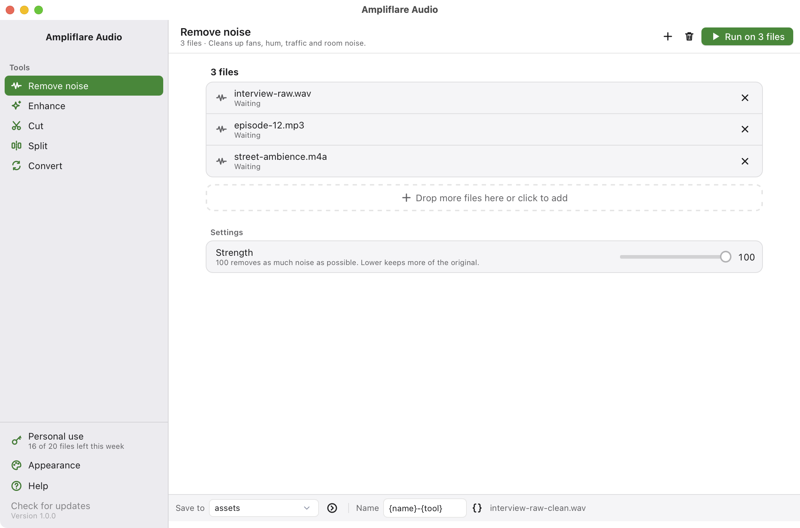

# Ampliflare Audio


Studio-quality voice, without the studio.

On-device machine learning strips background noise from speech, so podcasts, voiceovers and audiobooks sound studio-clean.

Everything runs on your computer, so **nothing is ever uploaded**. It works on macOS, Windows and Linux.

[Website](https://ampliflare.purplecandy.dev) · [Docs](https://ampliflare.purplecandy.dev/docs/) · [Release notes](https://ampliflare.purplecandy.dev/docs/releases/latest/)

<br clear="left"/>



---

## What it does

- **Remove noise** with DeepFilterNet3, a speech noise reduction model that runs on device, with a Strength slider
- **Enhance** by evening out loudness for music, podcasts, audiobooks or broadcast, and cutting low rumble
- **Cut** a file down to a start and end point, picked on a picture of the sound
- **Split** a file into parts at points you mark, or into equal parts
- **Convert** between wav, mp3, m4a, flac, ogg and opus

Every tool but Cut and Split runs on a whole list of files at once. A bar at the bottom says where results go and how they are named, and your originals are never changed.

## Install

Download the app for your computer from [the website](https://ampliflare.purplecandy.dev). Everything it needs comes inside, so there is nothing else to install.

| System | How |
| --- | --- |
| macOS | Open the disk image and drag the app to Applications. It is signed and notarized. |
| Windows | Run the setup file. It is not code-signed yet, so SmartScreen asks once: More info, then Run anyway. |
| Linux | Run the command below, or use the AppImage, .deb or .rpm. |

On Linux this installs the AppImage for your user, checks it against the release's checksums, and adds it to your app menu:

```sh
curl -fsSL https://static.purplecandy.dev/ampliflare-audio/releases/latest/download/install.sh | bash
```

The app updates itself. When a new version is out, a bar at the top offers to install it.

The downloaded app is free for personal use, up to 20 files a week. A [license](https://ampliflare.purplecandy.dev/docs/license/), at a price you pick, adds commercial use and removes the limit. A build from this source is free for any use. See [License](#license).

## How it is built

- [Tauri v2](https://v2.tauri.app) shell. The window is a system webview showing a React app.
- [Pico CSS](https://picocss.com) for styling. Plain HTML tags look right, so there is very little custom CSS.
- The spectrogram is computed in Rust with `rustfft` and drawn on a canvas. See `src-tauri/src/analyze.rs` and `src/components/Spectrogram.tsx`.
- The Rust side is thin. It builds command lines, runs two outside programs and reports progress.
- `deep-filter` does the noise reduction. It ships inside the app as a sidecar binary.
- `ffmpeg` does decode, encode, cut and loudness. It ships inside the app too, as `ampliflare-ffmpeg`, a prebuilt GPLv3 build. Its source is next to the binaries in the R2 bucket, under `ampliflare-audio/ffmpeg/`.

```
src/            React + TypeScript UI
src-tauri/src/  Rust. lib.rs wires plugins, jobs.rs runs the work, analyze.rs makes the spectrogram
src-tauri/binaries/  sidecar binaries, not committed, fetched by a script
scripts/        helper scripts
```

## Run it

You need Node 22, pnpm and Rust. The fetch script downloads deep-filter and ffmpeg.

```sh
curl --proto '=https' --tlsv1.2 -sSf https://sh.rustup.rs | sh
pnpm install
./scripts/fetch-sidecars.sh
pnpm tauri dev
```

## Test it faster

Debug builds can start with files already loaded and a tab already open:

```sh
AMPLIFLARE_DEV_FILES="/path/a.wav:/path/b.mp3" AMPLIFLARE_DEV_ACTION=cut pnpm tauri dev
```

A build from source has no weekly limit. To try the limit and the license key,
add `AMPLIFLARE_OFFICIAL_BUILD=1`, which CI sets for the downloadable app.

Rust tests need ffmpeg installed:

```sh
cd src-tauri && cargo test
```

## Build a release

```sh
pnpm tauri build
```

The result lands in `src-tauri/target/release/bundle/`.

CI builds, signs and notarizes every pull request. Pushing a `v*` tag publishes a
release with an in-app updater feed. See [docs/releasing.md](docs/releasing.md).

## Not done yet

- Dereverb. Needs a second model and a real inference runtime.
- Windows testing. CI builds it, but nobody has run it yet. It is not Authenticode signed.

## Contributing

Bug fixes are welcome. Open an issue before starting anything bigger.
[CONTRIBUTING.md](CONTRIBUTING.md) has the terms a pull request is accepted under.

## License

The source is [AGPL licensed](LICENSE) and can be built and run for free, for both personal and commercial use.

The prebuilt binaries follow Ampliflare Audio's [pricing terms](https://ampliflare.purplecandy.dev/docs/license/): free for personal use, license required for commercial use.
